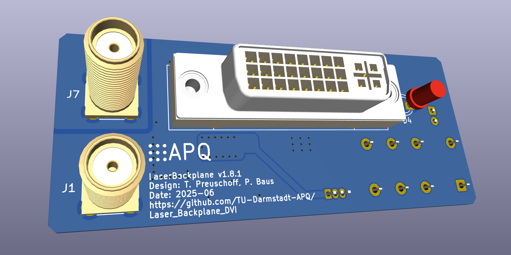
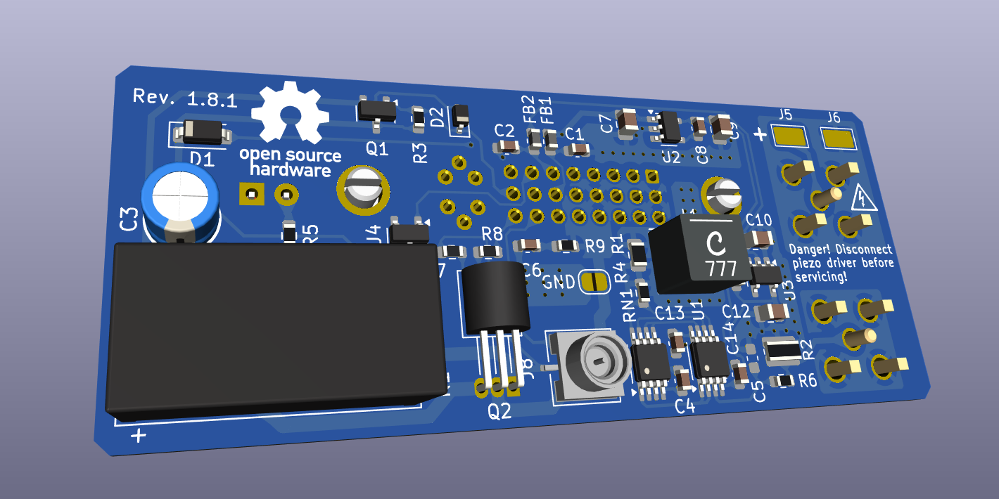

Laser Head with fast Modulation Input
===================

This repository contains the [KiCad](https://www.kicad.org/) design files for a compact laser backplane with a DVI connector for application in an ECDL laser system. The laser backplane features a fast current modulation input designed for large-bandwidth laser-frequency stabilization and a laser diode protection circuit. An additional connector for the laser piezo actuator is available.

Laser diode protection circuit
--------------------

The protection circuit consists of a relay and a reverse protection diode. The latching relay shorts the laser diode whenever the cable is disconnected or the current driver is turned off. In order to reduce the relay idle current, a latching relay and circuit are used. A fast switching transistor is used as reverse protection diode. The transistor features a very low reverse current leakage and a fast reverse recovery time.

Fast Current Modulation
--------------------
The fast modulation input consists of a Howland Current Pump complemented by a passive impedance matching network (see related work for details). It features:
- 3 dB gain flatness DC to 100 MHz
- Phase lag below 90° up to 25 MHz
- Transconductance gain of 1 mA / V
- Input voltage range ±4.8 V

**Note on the compliance voltage**
The compliance voltage of the Howland Current Pump is half of the positive output voltage swing of the operational amplifier. The circuit is implemented by a rail-to-rail output operational amplifier (ADA4807) supplied by ±5 V. Hence, the voltage at the laser diode anode is limited to 2.4 V accounting for a small head-room. Some additional head-room should be reserved for the (small) rise of the voltage required for the maximal output of the current source (5 mA). The maximal laser diode anode voltage is sufficient as a compliance voltage for infra red laser diodes. 

Pin Configuration
--------------------

Connector: DVI-I Dual Link (female)

| Pin 		| Signal 		| Description 	|
| --- 		| --- 			|	---			|
|  1 to 5 	|	NC			|				|
|  6  		|	-12 V		|	Negative supply for fast current modulation: -20 V to -5.5 V / 10 mA (max.)	|
|  7		|	EEPROM		|	Optional single wire EEPROM: AT21CS11	|
|  8  		| NC 			|				|
|  9  		| Ld-			| Laser diode cathode current pin 1/2	|
|  10  		| LD+			| Laser diode anode current pin 1/2		|
|  11  		| NC			|				|
|  12  		| Ld-			| Laser diode cathode current pin 2/2	|
|  13  		| LD+			| Laser diode anode current pin 2/2		|
|  14  		|	+12 V		| Positive supply for fast current modulation and protection circuit: 7 V to 18 V / 50 mA (max.) 	|
|  15  		| GND			| Ground reference for power supply	and modulation circuit  |
|  16  		| Relay-		| Connect to GND to switch the relay to 'laser on' state		|
|  17 to 22	| NC			| 				|
|  23  		| V_diode+		| Laser anode voltage sense connection		|
|  24  		| V_diode-		| Laser cathode voltage sense connection	|
|  C1 to C5	| NC			| 				|
|  SH		| NC			| 	Connect the shield to the laser case only			|

Design Files
------------------
The design files can be found on the [releases](../../releases) page and include the following resources:

- Schematics as a PDF
- Gerber files
- Pick & place position files
- Bill of materials as a CSV file and also as an interactive HTML version

The latest revision of those files can be found [here](../../releases/latest).

Related Work
--------------------

Review of Scientific Instruments **93**, 063002 (2022); https://doi.org/10.1063/5.0093520

arXiv:2203.06097 [physics.optics]; [https://arxiv.org/abs/2203.06097](https://arxiv.org/abs/2203.06097)

T. Preuschoff, *Laser Technologies for Applications in Quantum Information Science*, Ph.D. thesis, TU Darmstadt, 2023, [https://tuprints.ulb.tu-darmstadt.de/23242/](https://tuprints.ulb.tu-darmstadt.de/23242/)

License
-------

This work is released under the CERN OHL v.1.2
See www.ohwr.org/licenses/cern-ohl/v1.2 or the included LICENSE file for more information.
